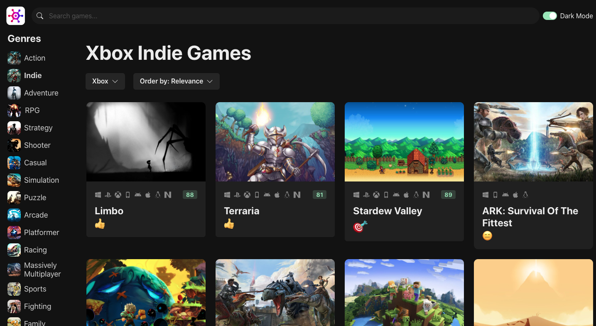
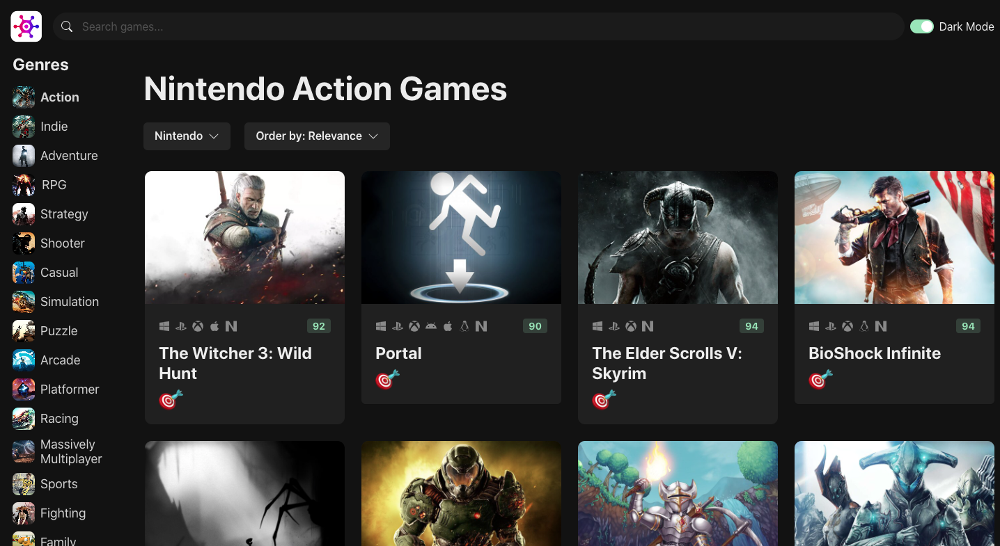

# Game Hub
## _A modern video game discovery app_

Game Hub allows users to browse and filter video games by genre, platform, and rating — powered by the RAWG video game database API.

## Live Demo

You can view a live demo of the app deployed on Vercel by clicking the link below:

[Game Hub - Live Demo](https://game-hub-db.vercel.app/)

## Screenshots

**Xbox Indie Games View**  

**Nintendo Action Games View**  

## Features

- Game search with auto-complete
- Filter games by genre, platform, and sort order
- Responsive layout for mobile and desktop
- Clean, modular component structure

Game Hub is a responsive, user-friendly application designed to make exploring video games easy and visually engaging. It leverages a modern front-end stack and third-party API integrations to deliver live, dynamic content.

## Tech

Game Hub uses the following technologies:

- React
- TypeScript
- Vite
- Zustand (state management)
- Chakra UI
- RAWG API
- Vercel (deployment)

## Acknowledgements

Game Hub was built as a personal portfolio project to demonstrate full-stack development skills including API integration, UI/UX design, and clean component architecture.
